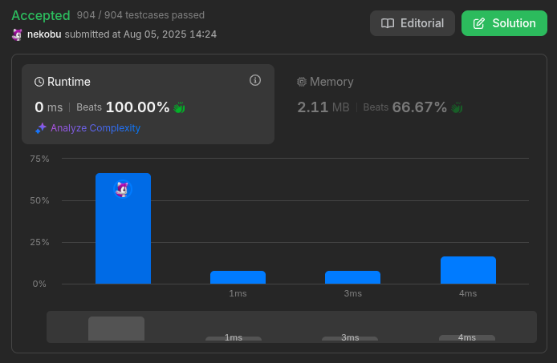

# [3477. Fruit Into Baskets II](https://leetcode.com/problems/fruits-into-baskets-ii/description/?envType=daily-question&envId=2025-08-05)

Funny story with this one: when I submitted the final solutions, I was shown that [my solution](./3477.fruit-into-baskets-ii.rs) supposedly beat 100% of other submissions that used Rust for this problem, as shown in the image below:

Looking at it now, though... it doesn't really feel that impressive, considering that I'm very sure that I misinterpreted this.

I hope I misinterpreted that...
