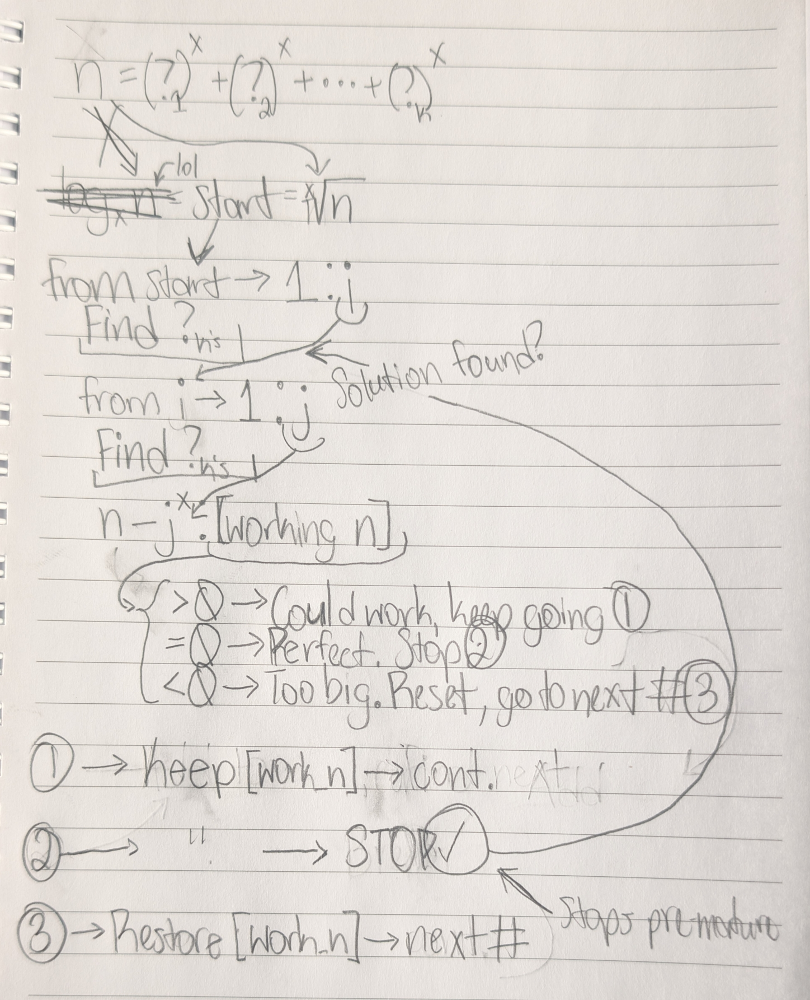

- They love doing these elaborate math problems, don't they...
- Okay, thinking about this, maybe we could start by taking the log base `x` of `n`, then getting the floor of that
	- We can then use that as the starting point of the loop to do this
		- Take that starting number
			- Square it
			- Subtract it from some working `n`
		- Actually, this might not be a good idea, since it would really just give you the biggest chunks...
			- ...
				- How would you even begin to get *all* of the possible solutions?
					- The original one that I thought of was a top-down approach, which would get you the biggest chunks at least.
						- In which case, how would you even begin to check for possible solutions that are made of part of the larger chunks?
							- Sounds like some painful recursive stuff
							- The first hint gives a bit of a solution to that problem,
							  > You can use dynamic programming, where dp[k][j] represents the number of ways to express k as the sum of the x-th power of unique positive integers such that the biggest possible number we use is j.  
								- I guess what I could do, then, is...
									- Start at the calculated starting number (the floor of the log base `x` of `n` from earlier)
										- Then start a loop from there down to 1 to find all the bases that could be used
											- Will need to break this down later
										- Do the same thing as above, but with decreasing integers
											- The range would need to be a ~~`reverse(range())`~~ `reversed(range())`
					- The other way I'm thinking of is going bottom-up, starting from 1, squaring the number, adding it to a total, and going up to the next integer and repeating this until you get to the sum or surpass it...
						- In the case of the latter (surpassing it), consider it not a solution, and the opposite for the former (getting the sum)...

